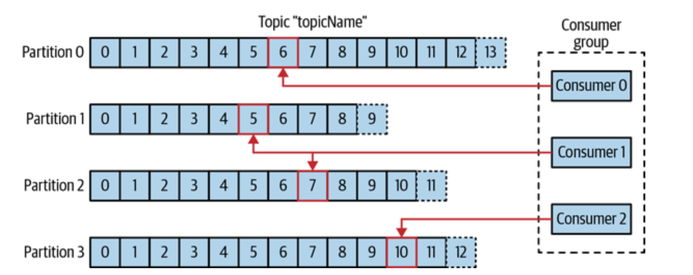
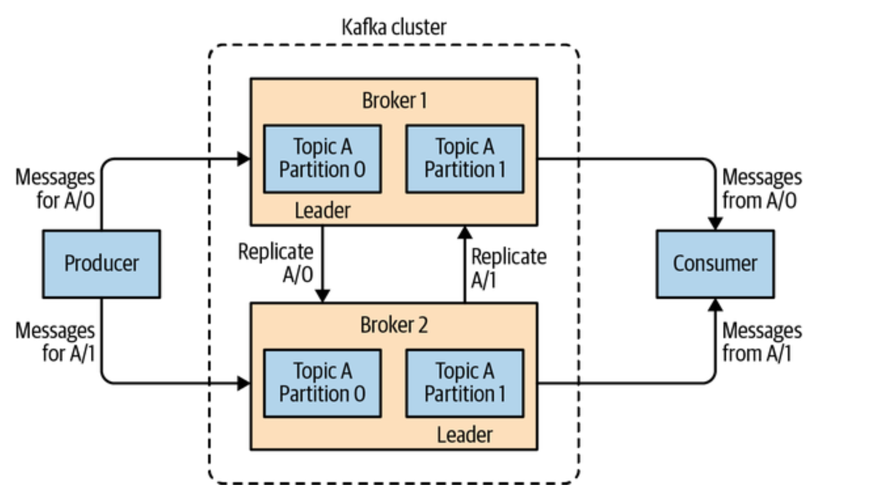
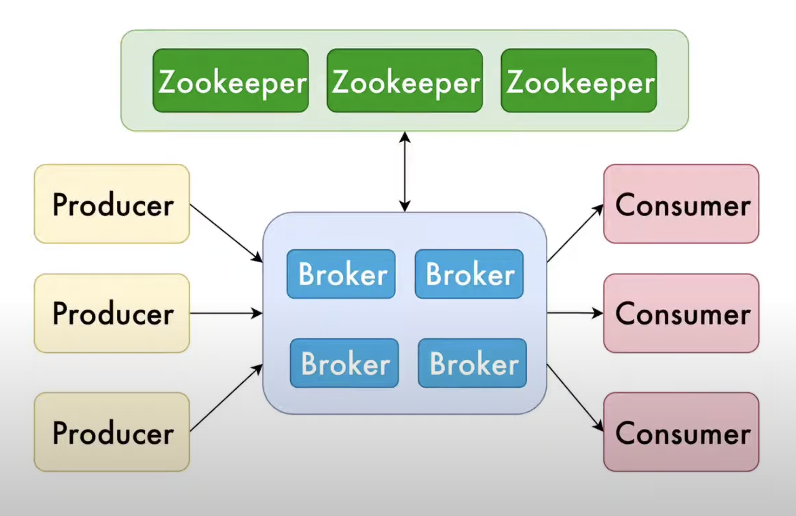
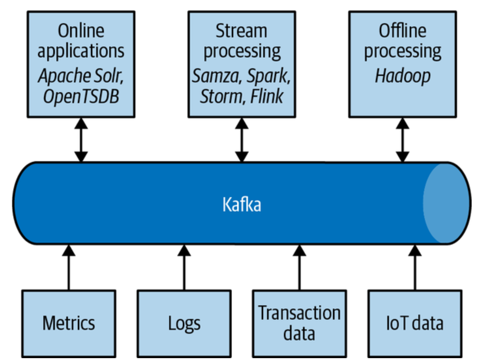

# Apache Kafka: Powering Real-Time Data Streaming

## What is Kafka?

Apache Kafka is a distributed event streaming platform designed to handle high-throughput, fault-tolerant, and scalable data pipelines in real-time.

### Benefits of Kafka:
- High throughput for both publishing and subscribing
- Low latency (as low as 10 milliseconds)
- Fault-tolerant and durability
- Scalability (can handle trillions of events a day)
- Real-time processing

## Why use Kafka for data streaming and integration?

1. **Decoupling of data streams and systems:** Kafka acts as a central data backbone.
2. **Scalability:** Can handle growing amounts of data effortlessly.
3. **Durability and reliability:** Data is persisted on disk and replicated within the cluster.
4. **High performance:** High-throughput message publishing and subscribing.
5. **Ecosystem:** Wide range of tools and frameworks that integrate with Kafka.

## Key Concepts

### Topics
- A particular stream of data
- Similar to a table in a database (without constraints)
- Identified by name
- Can have multiple topics in a cluster
- The topic schema can be anything (e.g., JSON, Avro, etc.)

### Partitions
- Topics are split into partitions
- Each partition is ordered
- Each message within a partition gets an incremental id called offset
- Each message has a unique identifier that determines its position and the partition it belongs to

## Kafka Architecture

### ZooKeeper
- Manages and coordinates Kafka brokers
- Notifies producers and consumers about new brokers or broker failures
- Manages topic configuration
- Stores metadata about the Kafka cluster

### Brokers
- A Kafka cluster is composed of multiple brokers (servers)
- Each broker contains certain topic partitions
- Each broker only manages one partition at a time
- After connecting to any broker (bootstrap server), you're connected to the entire cluster

### Leaders
- For a particular partition, one broker will be the leader
- Only the leader can receive and serve data for a partition
- Other brokers will synchronize the data (replication)

### Replication
- Each partition has multiple replicas
- Replicas are just copies of the partition's Data
- Replicas are never Leaders
- Replicas ensure fault tolerance
- If a broker goes down, another replica can take over as the Leader

### Producers
- Write data to topics (which is made of partitions)
- Automatically know which broker and partition to write to
- Can choose to receive acknowledgment of data writes

### Consumers
- Read data from a topic (identified by name)
- Know which broker to read from
- Can read from one or many partitions
- Data is read in order within each partition

### Coordinators

Coordinators play a crucial role in managing consumer groups and ensuring efficient message consumption. There are two types of coordinators in Kafka:

#### Group Coordinator
- Responsible for managing the overall state of a consumer group
- Handles consumer group joins, leaves, and failures
- Assigns partitions to consumers within a group (rebalancing)
- Typically runs on one of the Kafka brokers

Key responsibilities:

1. **Group Membership:** Keeps track of all consumers in a group
2. **Partition Assignment:** Decides which consumer should read from which partitions
3. **Rebalancing:** Triggers and manages the rebalancing process when consumers join or leave the group

#### Consumer Coordinator
- A component within each Kafka consumer
- Communicates with the Group Coordinator to manage the consumer's participation in its group

Key responsibilities:

1. **Heartbeats:** Sends periodic heartbeats to the Group Coordinator to signal that the consumer is alive
2. **Partition Assignment:** Receives partition assignments from the Group Coordinator and applies them
3. **Offset Management:** Keeps track of the consumer's progress by managing offsets

The interaction between Group Coordinators and Consumer Coordinators ensures that:

- Consumers are evenly distributed across partitions
- The system can quickly detect and respond to consumer failures
- Consumption can be scaled up or down by adding or removing consumers from a group

Understanding coordinators is crucial for optimizing Kafka's performance and ensuring smooth operation of consumer groups, especially in large-scale, distributed systems.

## Consumer Groups

Consumer groups allow you to parallelize the consumption of messages from Kafka topics.

### How they work:
1. Each consumer in a group reads from exclusive partitions
2. If you have more consumers than partitions, some consumers will be inactive

### Importance:
- Enables scalable message consumption
- Provides fault tolerance for consumers
- Allows for easy scaling up and down of consumers

## The infrastructure backbone

